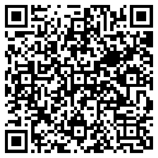

# QR Platba

FORK od https://github.com/dfridrich/QRPlatba

[](https://packagist.org/packages/swejzi/qr-platba)
[](https://packagist.org/packages/swejzi/qr-platba)
[](https://travis-ci.com/Swejzi/QRPlatba)
[](https://coveralls.io/github/Swejzi/QRPlatba)

Knihovna pro generování QR plateb v PHP. QR platba zjednodušuje koncovému uživateli
provedení příkazu k úhradě, protože obsahuje veškeré potřebné údaje, které stačí jen
naskenovat. Nově lze použít i jiné měny než CZK a to pomocí metody ```setCurrenty($currency)```.

Tato knihovna umožňuje:

- zobrazení obrázku v `````` tagu, který obsahuje v ```src``` rovnou data-uri s QR kódem, takže vygenerovaný
obrázek tak není třeba ukládat na server (```$qrPlatba->getQRCodeImage()```)
- uložení obrázku s QR kódem (```$qrPlatba->saveQRCodeImage()```)
- získání data-uri (```$qrPlatba->getQRCodeResult()->getDataUri()```)
- získání instance objektu [QrCode](https://github.com/endroid/QrCode) (```$qrPlatba->getQRCodeInstance()```) 

QRPlatbu v současné době podporují tyto banky:
Air Bank, Česká spořitelna, ČSOB, Equa bank, Era, Fio banka, Komerční banka, mBank, Raiffeisenbank, ZUNO.


Podporuje PHP od 7.3 až 8.0.

## Instalace pomocí Composeru

`composer require swejzi/qr-platba`

## Příklad

```php
<?php

require __DIR__ . '/vendor/autoload.php';

use Swejzi\QRPlatba\QRPlatba;

$qrPlatba = new QRPlatba();

$qrPlatba->setAccount('12-3456789012/0100')
    ->setVariableSymbol('2016001234')
    ->setMessage('Toto je první QR platba.')
    ->setSpecificSymbol('0308')
    ->setSpecificSymbol('1234')
    ->setCurrency('CZK') // Výchozí je CZK, lze zadat jakýkoli ISO kód měny
    ->setDueDate(new \DateTime());

echo $qrPlatba->getQRCodeImage(); // Zobrazí  tag s kódem, viz níže  
```



Lze použít i jednodušší zápis:

```php
use Swejzi\QRPlatba\QRPlatba;

echo QRPlatba::create('12-3456789012/0100', 987.60)
    ->setMessage('QR platba je parádní!')
    ->getQRCodeImage();
```

### Další možnosti

Uložení do souboru
```php
// Uloží png o velikosti 100x100 px
$qrPlatba->saveQRCodeImage("qrcode.png", 100, 0, "png");

// Uloží svg o velikosti 100x100 px
$qrPlatba->saveQRCodeImage("qrcode.svg", 100, 0, "svg");
```

Aktuální možné formáty jsou: 
* Png
* Pdf
* Svg
* Eps
* binární
* debug

Pro další je potřeba dopsat vlastní Writter

Zobrazení data-uri
```php
// data:image/png;base64,iVBORw0KGgoAAAANSUhEUgAAAUAAAAFAAQMAAAD3XjfpAAAA...
echo $qrPlatba->getQRCodeResult()->getDataUri();
```

## Odkazy

- Dokumentace - http://dfridrich.github.io/QRPlatba/
- Oficiálí web QR Platby - http://qr-platba.cz/
- Repozitář, který mě inspiroval - https://github.com/snoblucha/QRPlatba

## Contributing

Budu rád za každý návrh na vylepšení ať už formou issue nebo pull requestu.
