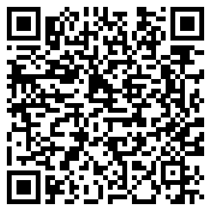
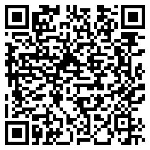
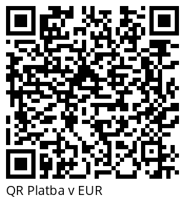
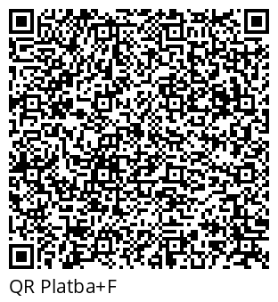
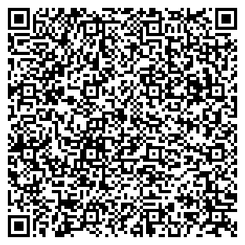
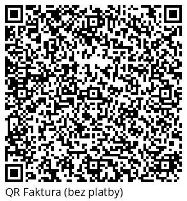

# QR Platba a QR Faktura

[](https://packagist.org/packages/dfridrich/qr-platba)
[](https://packagist.org/packages/dfridrich/qr-platba)
[](https://travis-ci.org/dfridrich/QRPlatba)
[](https://coveralls.io/github/dfridrich/QRPlatba?branch=master)


Knihovna pro generování QR plateb v PHP. QR platba zjednodušuje koncovému uživateli
provedení příkazu k úhradě, protože obsahuje veškeré potřebné údaje, které stačí jen
naskenovat. Nově lze použít i jiné měny než CZK a to pomocí metody ```setCurrenty($currency)```.

Tato knihovna umožňuje:

- zobrazení obrázku v `````` tagu, který obsahuje v ```src``` rovnou data-uri s QR kódem, takže vygenerovaný
obrázek tak není třeba ukládat na server (```$qrPlatba->getQRCodeImage()```)
- uložení obrázku s QR kódem (```$qrPlatba->saveQRCodeImage()```)
- získání data-uri (```$qrPlatba->getDataUri()```)
- získání instance objektu [QrCode](https://github.com/endroid/QrCode) (```$qrPlatba->getQRCodeInstance()```) 

QRPlatbu v současné době podporují tyto banky:
Air Bank, Česká spořitelna, ČSOB, Equa bank, Era, Fio banka, Komerční banka, mBank, Raiffeisenbank, ZUNO.


Podporuje PHP 7.4 až 8.1.

## Instalace pomocí Composeru

`composer require "dfridrich/qr-platba:^2"`

## Příklad

```php
<?php

require __DIR__ . '/vendor/autoload.php';

use Defr\QRPlatba\QRPlatba;

$qrPlatba = new QRPlatba();

$qrPlatba->setAccount('12-3456789012/0100') // nastavení č. účtu
    ->setIBAN('CZ3112000000198742637541') // nastavení č. účtu
    ->setVariableSymbol('2016001234')
    ->setMessage('Toto je první QR platba.')
    ->setConstantSymbol('0308')
    ->setSpecificSymbol('1234')
    ->setAmount('1234.56')
    ->setCurrency('CZK') // Výchozí je CZK, lze zadat jakýkoli ISO kód měny
    ->setDueDate(new \DateTime());

echo $qrPlatba->getQRCodeImage(); // Zobrazí  tag s kódem, viz níže  
```

Ukázky (viz `test/OutputTest.php`), zkuste si je naskenovat v bankovnictví nebo třeba iDokladu jako QR Fakturu:

**QR Platba (PNG):**<br>


**QR Platba v EUR (PNG):**<br>


**QR Platba (SVG):**<br>


**QR Platba a popisek (PNG):**<br>


**QR Platba a popisek v EUR (PNG):**<br>


**QR Platba a popisek (SVG):**<br>


**QR Platba+F a popisek (PNG):**<br>


**QR Platba+F a popisek v EUR (PNG):**<br>


**QR Platba+F a popisek (SVG):**<br>


**QR Faktura bez platby (SVG):**<br>


Lze použít i jednodušší zápis:

```php
echo QRPlatba::create('12-3456789012/0100', 987.60)
    ->setMessage('QR platba je parádní!')
    ->getQRCodeImage();
```

Pro IBAN pak:

```php
echo QRPlatba::create('CZ6508000000192000145399', 987.60)
    ->setMessage('QR platba je parádní!')
    ->getQRCodeImage();
```

### Další možnosti

Uložení do souboru
```php
// Uloží png o velikosti 100x100 px
$qrPlatba->saveQRCodeImage("qrcode.png", "png", 100);

// Uloží svg o velikosti 100x100 px
$qrPlatba->saveQRCodeImage("qrcode.svg", "svg", 100);

// Generování jen QR Faktury
$qrPlatba->setIsOnlyInvoice(true)->setLabel('QR Faktura');
```

Aktuální možné formáty jsou: 
* PNG
* SVG

Pro další je potřeba dopsat vlastní Writer

Zobrazení data-uri
```php
// data:image/png;base64,iVBORw0KGgoAAAANSUhEUgAAAUAAAAFAAQMAAAD3XjfpAAAA...
echo $qrPlatba->getDataUri();
```

## Odkazy

- Oficiální web QR Platby - http://qr-platba.cz/
- Oficiální web QR Faktury - http://qr-faktura.cz/
- Repozitář, který mě inspiroval - https://github.com/snoblucha/QRPlatba
- Fork, ze kterého jsem zpětně přidal a upravil implementaci QR Faktury - https://github.com/bonami/qr-platba
- <a href="https://www.freepik.com/free-vector/scan-pay-concept-illustration_18840607.htm#query=qr%20code%20scanner&position=27&from_view=search">Image by storyset</a> on Freepik

## Contributing

Budu rád za každý návrh na vylepšení ať už formou issue nebo pull requestu.
